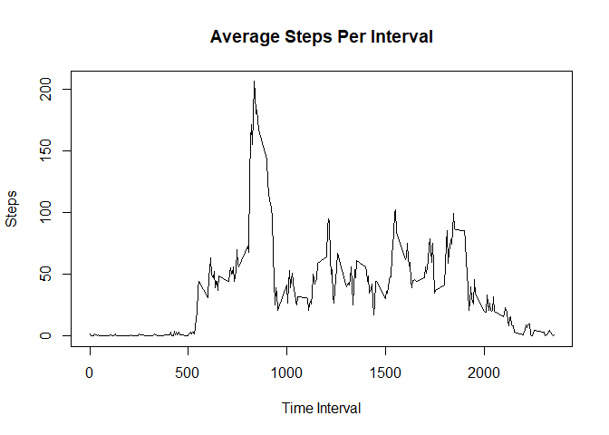

## Loading and preprocessing the data

1. Load the data

``` r
# read all data
activity_all <- read.csv("activity.csv")
View(activity_all)
```

2. Process data if needed

``` r
# remove NA values
activity <- na.omit(activity_all)
View(activity)
```

## What is mean total number of steps taken per day?

1. Calculate the total number of steps per day

``` r
# aggregate the total steps per day
total_steps_per_day <- aggregate(steps ~ date, data = activity, sum)
```

2. Make a histogram

``` r
# use base plot to create histogram
hist(total_steps_per_day$steps,
     breaks = 10,
     col = "green",
     border = "black",
     main = "Histogram of Total Number of Steps Taken Each Day",
     xlab = "Total Steps",
     ylab = "Frequency")
```

<!-- -->

3. Calculate the mean and the median


``` r
# calculate the mean total number of steps per day
mean_steps_per_day <- mean(total_steps_per_day$steps)
median_steps_per_day <- median(total_steps_per_day$steps)

# Print the result
print(paste("Mean of the total number of steps taken per day: ", mean_steps_per_day))
```

```
## [1] "Mean of the total number of steps taken per day:  10766.1886792453"
```

``` r
print(paste("Median of the total number of steps taken per day: ", median_steps_per_day))
```

```
## [1] "Median of the total number of steps taken per day:  10765"
```

## What is the average daily activity pattern?

1. Make a time series plot

``` r
mean_steps_per_interval <- round(aggregate(steps ~ interval, data = activity, mean))
plot(mean_steps_per_interval,type = "l", xlab="Time Interval", ylab="Steps", main="Average Steps Per Interval")
```

<!-- -->

2. Find the 5-min interval with maximum steps

``` r
max_interval <- mean_steps_per_interval[which.max(mean_steps_per_interval$steps), ]$interval
max_interval <- sprintf("%04s", max_interval)
print(paste("The interval with the maximum number of steps is: ", substr(max_interval, 1, 2),":",substr(max_interval, 3, 4)))
```

```
## [1] "The interval with the maximum number of steps is:   8 : 35"
```

## Imputing missing values

1. Let's calculate the total number of missing values.

``` r
total_missing <- sum(is.na(activity_all))
# Print the result
print(paste("Total number of missing values in the dataset:", total_missing))
```

```
## [1] "Total number of missing values in the dataset: 2304"
```

2. The strategy is to fill in all of the missing values with mean steps for the same interval.

3. Now we can create a new dataset with imputed values.

``` r
# merge the mean steps back into the original data frame
activity_imputed <- merge(activity_all, mean_steps_per_interval, by = "interval", suffixes = c("", ".mean"))

# impute the missing values with the mean steps for each interval
activity_imputed$steps[is.na(activity_imputed$steps)] <- activity_imputed$steps.mean[is.na(activity_imputed$steps)]

# remove the temporary column with mean steps
activity_imputed <- activity_imputed[, c("interval", "steps","date")]
View(activity_imputed)
```

4. We make a histogram using the new dataset

``` r
# aggregate the total steps per day
total_steps_per_day_imputed <- aggregate(steps ~ date, data = activity_imputed, sum)

# use base plot to create histogram
hist(total_steps_per_day_imputed$steps,
     breaks = 10,
     col = "green",
     border = "black",
     main = "Histogram of Total Steps Each Day (Imputed)",
     xlab = "Total Steps",
     ylab = "Frequency")
```

<!-- -->

``` r
# calculate the mean total number of steps per day
mean_steps_per_day_imputed <- mean(total_steps_per_day_imputed$steps)
median_steps_per_day_imputed <- median(total_steps_per_day_imputed$steps)

# Print the result
print(paste("Mean of the total number of steps taken per day: ", mean_steps_per_day_imputed))
```

```
## [1] "Mean of the total number of steps taken per day:  10765.6393442623"
```

``` r
print(paste("Median of the total number of steps taken per day: ", median_steps_per_day_imputed))
```

```
## [1] "Median of the total number of steps taken per day:  10762"
```
## Are there differences in activity patterns between weekdays and weekends?
1. Create a new factor variable

``` r
activity_imputed$day_type <- ifelse(weekdays(as.Date(activity_all$date)) %in% c("Saturday", "Sunday"), "weekend", "weekday") 
activity_imputed$day_type <- factor(activity_imputed$day_type, levels = c("weekday", "weekend"))
```

2. Make a panel plot comparing weekend and weekdays

``` r
# install.packages("lattice")
library(lattice)

# calculate the mean steps for each interval and day_type 
avg_steps <- aggregate(steps ~ interval + day_type, data = activity_imputed, FUN = function(x) mean(x))

xyplot(steps ~ interval | day_type, data = avg_steps, type = "l", layout = c(1, 2), xlab = "5-minute Interval", ylab = "Average Number of Steps", main = "Average Steps per Interval by Day Type")
```

<!-- -->
